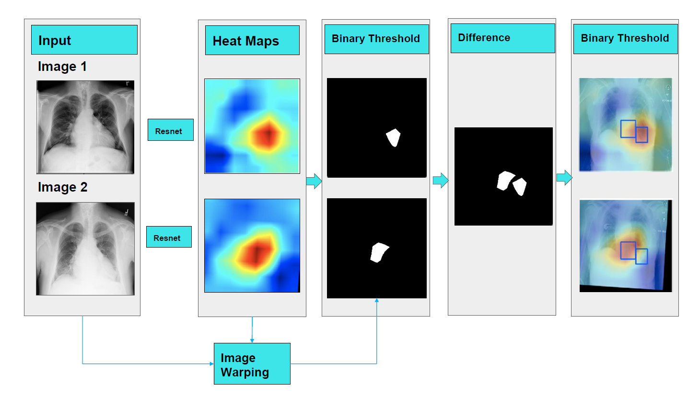
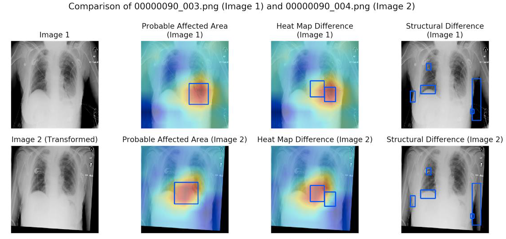

# ProjectX

Chest XRay thoracic disease classification, localization and disease progression on the Stanford ChestX-ray14 dataset. Implemented using PyTorch 0.3 and iPython. 
Resnet50 trained with multi-class soft margin loss. For details and results refer to the presentation and report. 

## Running

1. Run any ProjectX*.ipynb
2. For heatmaps refer HeatMapGenerator

